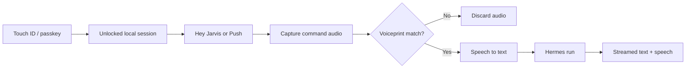

# J.A.R.V.I.S.

<p align="center">
  <strong>A private, local-first voice and text command interface for Hermes Agent.</strong>
</p>

<p align="center">
  
  
  
  
  
</p>

J.A.R.V.I.S. is a local macOS dashboard for [Hermes Agent](https://hermes-agent.nousresearch.com/docs). It provides a cinematic browser HUD, typed and spoken commands, local **“Hey Jarvis”** activation, streamed responses, progressive speech, and a server-enforced owner-authentication boundary.

The dashboard listens only on loopback. Hermes credentials remain on the server and never enter browser JavaScript.

> [!IMPORTANT]
> This is a personal local assistant, not a production identity system. Touch ID/passkeys provide the strongest authentication factor. Voiceprints can potentially be spoofed by recordings or synthesized speech.

## Features

- **Local “Hey Jarvis” wake phrase** using openWakeWord and its bundled `hey_jarvis` model.
- **Touch ID/passkey unlock** through WebAuthn’s platform authenticator.
- **Per-command voiceprint verification** before speech is transcribed or sent to Hermes.
- **Face recognition disabled by default**—no camera permission is requested in the recommended configuration.
- **Server-side authorization** for wake streams, transcription, and Hermes runs.
- **Typed and push-to-talk controls** as alternatives to wake mode.
- **Streaming Hermes responses** with live tool and approval telemetry.
- **Progressive TTS** through ElevenLabs, with browser speech synthesis as a fallback.
- **Serialized speech queue** that prevents overlapping responses.
- **Kill Voice control** that immediately stops and suppresses speech for the current run.
- **Encrypted local biometric templates** with a macOS Keychain-backed encryption key when available.
- **Explicit lock and identity-reset controls**.

## Authentication flow



The wake phrase is an activation mechanism, **not authentication**. The active policy is:

1. Touch ID creates an eight-hour in-memory session.
2. Wake listening is available only while that session is unlocked.
3. Every spoken directive must match the enrolled voiceprint.
4. Failed voice audio is discarded before STT and never reaches Hermes.
5. `/api/run` independently requires a valid session and recent voice match.

Face authentication remains available only as experimental code behind `JARVIS_FACE_AUTH_ENABLED=true`. It is disabled because ordinary lighting changes caused unreliable matches. While disabled, face endpoints return HTTP 410 and the browser does not start a camera stream.

## Requirements

- macOS with Touch ID configured
- Python **3.11**
- [Hermes Agent](https://hermes-agent.nousresearch.com/docs) installed and configured
- A Touch ID/passkey-capable browser
- Microphone permission for `http://localhost:8787`
- Node.js only for JavaScript regression tests
- Optional: ElevenLabs API key for cloud STT/TTS
- Optional: Whisper CLI and ffmpeg for local STT fallback

> [!NOTE]
> Python 3.14 is not currently supported by the pinned `openwakeword==0.6.0` stack. The launcher prefers Python 3.11 automatically.

## Quick start

```bash
git clone https://github.com/LVZFR/J.A.R.V.I.S.git
cd J.A.R.V.I.S
cp .env.example .env
./scripts/register_gateway.sh
```

The registration script:

- enables the Hermes API server on loopback,
- creates a secure random bearer key,
- safely updates existing configuration,
- mirrors the key into the project `.env`, and
- applies mode `0600` to credential files.

Restart the Hermes gateway so it loads the new configuration:

```bash
hermes gateway restart
```

Start J.A.R.V.I.S.:

```bash
./scripts/start.sh
```

Open **http://localhost:8787**.

Use `localhost`, not `127.0.0.1`, because WebAuthn passkeys are bound to the `localhost` relying-party identity. Requests to `127.0.0.1` are redirected automatically.

## First-time enrollment

1. Open `http://localhost:8787`.
2. Click **INITIALIZE TOUCH ID**.
3. Approve the platform-authenticator prompt with Touch ID.
4. Grant microphone permission.
5. Record three prompted voice samples saying **“Jarvis, authorize Don.”**
6. Click **ENTER JARVIS**.
7. Enable **WAKE MODE**.
8. Say **“Hey Jarvis,”** wait for the tone, then speak your directive.

On later launches, click **VERIFY WITH TOUCH ID** to unlock the existing enrollment. No camera enrollment is required.

## Configuration

Copy `.env.example` to `.env` and edit only your local copy. Never commit `.env`.

| Variable | Default | Purpose |
|---|---:|---|
| `JARVIS_HOST` | `127.0.0.1` | Loopback bind address |
| `JARVIS_PORT` | `8787` | Dashboard port |
| `HERMES_API_BASE` | `http://127.0.0.1:8642` | Hermes API server |
| `HERMES_PROFILE` | `default` | Hermes profile used for runs |
| `JARVIS_WAKEWORD_THRESHOLD` | `0.55` | Higher values make wake detection stricter |
| `JARVIS_VOICEPRINT_THRESHOLD` | `0.82` | Higher values make voice matching stricter |
| `JARVIS_FACE_AUTH_ENABLED` | `false` | Experimental face gate; keep disabled |
| `JARVIS_AUTH_RP_ID` | `localhost` | WebAuthn relying-party ID |
| `JARVIS_AUTH_ORIGIN` | `http://localhost:8787` | Expected browser origin |
| `ELEVENLABS_API_KEY` | empty | Optional ElevenLabs STT/TTS credential |
| `ELEVENLABS_VOICE_ID` | empty | Optional ElevenLabs voice override |
| `ELEVENLABS_MODEL_ID` | `eleven_multilingual_v2` | TTS model |
| `ELEVENLABS_STT_MODEL_ID` | `scribe_v1` | STT model |
| `JARVIS_WHISPER_MODEL` | `base` | Local Whisper fallback model |

When an ElevenLabs key is not configured, J.A.R.V.I.S. attempts local Whisper for STT and browser `speechSynthesis` for spoken output.

## Using J.A.R.V.I.S.

### Wake mode

Click **WAKE MODE** once and wait for the HUD to display `ARMED`. Say **“Hey Jarvis,”** wait for the confirmation tone, then speak. Wake processing pauses while J.A.R.V.I.S. is executing or speaking and rearms after the response queue becomes idle.

Ambient wake audio is downsampled to 16 kHz mono PCM and sent only to the local FastAPI WebSocket. It is not uploaded to ElevenLabs for wake detection.

### Push to talk

Click **PUSH**, speak, and pause. Recording stops automatically after detected speech followed by silence. The voiceprint is checked before STT.

### Typed commands

Type a directive and press Enter or click **TRANSMIT**. Typed runs still require a recent voice match; use **PUSH** first when the previous match has expired.

### Hermes commands

The command deck can prepend:

- `/new`
- `/goal`
- `/profile`
- `/background`
- `/personality`
- `/kanban`

### Kill Voice

**KILL VOICE** stops active HTML audio, clears queued speech, cancels browser speech synthesis, and suppresses additional spoken chunks for the current run. Hermes continues running and text events continue rendering.

## Architecture

```text
Browser HUD
├── WebAuthn / Touch ID
├── Wake-word PCM stream
├── Voiceprint capture
├── Typed directives
└── Streamed text + sequential speech
          │
          ▼
FastAPI bridge · localhost:8787
├── Authentication policy
├── Local openWakeWord inference
├── Voiceprint extraction and matching
├── STT proxy / Whisper fallback
├── TTS proxy
└── Hermes Runs API + SSE relay
          │
          ▼
Hermes API Server · 127.0.0.1:8642
```

## Project structure

```text
.
├── server.py                     # FastAPI bridge and authorization boundary
├── auth.py                       # Passkeys, voiceprints, encrypted storage
├── wakeword.py                   # Local Hey Jarvis detector
├── static/
│   ├── index.html                # HUD markup
│   ├── styles.css                # Cyan/amber interface
│   ├── app.js                    # Browser orchestration
│   ├── auth-client.js            # WebAuthn and authentication gate
│   ├── wake-word.js              # Audio downsampling and frame buffering
│   └── voice-queue.js            # Sequential speech playback
├── scripts/
│   ├── register_gateway.sh       # Hermes API configuration
│   ├── start.sh                  # Python 3.11 environment and server startup
│   └── reset_identity.sh         # Complete local identity reset
├── tests/                        # Python and JavaScript regressions
├── requirements.txt
└── .env.example
```

## API overview

| Method | Endpoint | Purpose |
|---|---|---|
| `GET` | `/api/status` | Gateway, STT, TTS, and wake availability |
| `POST` | `/api/run` | Submit an authenticated Hermes run |
| `GET` | `/api/runs/{run_id}` | Read run status |
| `GET` | `/api/runs/{run_id}/events` | Relay Hermes SSE events |
| `POST` | `/api/approval` | Resolve a Hermes approval request |
| `POST` | `/api/stt` | Transcribe authenticated multipart audio |
| `POST` | `/api/tts` | Proxy server-side TTS |
| `WS` | `/api/wakeword` | Local wake-word inference stream |
| `GET` | `/api/auth/status` | Enrollment and current-factor status |
| `POST` | `/api/auth/passkey/...` | Passkey registration and verification |
| `POST` | `/api/auth/voice/...` | Voiceprint enrollment and verification |
| `POST` | `/api/auth/logout` | Lock the current session |

Hermes bearer credentials are never returned by `/api/status` or sent to browser JavaScript.

## Testing

```bash
.venv/bin/python -m unittest discover -s tests -p 'test_*.py' -v
node tests/auth_client.test.js
node tests/wake_word.test.js
node tests/voice_queue.test.js
node --check static/app.js
node --check static/auth-client.js
.venv/bin/python -m py_compile server.py auth.py wakeword.py
bash -n scripts/start.sh scripts/register_gateway.sh scripts/reset_identity.sh
```

The suite covers passkey-plus-voice policy enforcement, disabled face endpoints, encrypted template storage, unauthorized-run rejection, wake detection and debouncing, PCM framing, voice-queue serialization, and kill suppression.

## Privacy and security

- The service binds to loopback only.
- `.env`, `.jarvis-auth`, and local virtual environments are excluded from Git.
- Passkey private keys remain inside the platform authenticator.
- The server stores only passkey credential metadata and public keys.
- Raw enrollment and command recordings are discarded after processing.
- Voice templates are encrypted locally.
- The encryption key is stored in the macOS login Keychain when available.
- Browser-only checks are not trusted; protected endpoints enforce authorization again.
- Wake-word activation does not prove identity.
- Voiceprints remain vulnerable to replay, voice cloning, and high-quality synthesis.

Keep sensitive system actions behind Hermes approvals and normal macOS authorization prompts.

## Locking and identity reset

Click **IDENTITY → LOCK SESSION** to lock without deleting enrollment.

To erase all local passkey and biometric enrollment:

```bash
./scripts/reset_identity.sh
```

Do not manually delete only part of `.jarvis-auth`; use the reset script so the encrypted files and associated Keychain item stay consistent.

## Troubleshooting

### Touch ID is unavailable

Use exactly `http://localhost:8787`, verify that Touch ID is configured in macOS, and confirm passkeys are enabled in the browser.

### Microphone permission was denied

Allow microphone access for `localhost` in the browser’s site settings. Camera access should not be requested while face authentication is disabled.

### Valid voice is rejected

Re-enroll in a quiet room and use a consistent speaking distance. Lower `JARVIS_VOICEPRINT_THRESHOLD` cautiously; lower values accept less-similar voices and increase false-accept risk.

### Wake mode remains on loading

The first activation downloads openWakeWord model assets. Confirm that the project uses Python 3.11 and inspect the server output for model-download errors.

### Gateway is offline

```bash
hermes gateway status
hermes gateway restart
```

Inspect `~/.hermes/logs/gateway.log` if the problem persists.

### STT or TTS is unavailable

Check `/api/status`. Configure ElevenLabs, or install both Whisper CLI and ffmpeg for local STT fallback:

```bash
pipx install openai-whisper
brew install ffmpeg
```

## Third-party licensing

The openWakeWord library is Apache-2.0. Its bundled pretrained wake-word models are licensed CC BY-NC-SA 4.0. Review the model license before commercial distribution.

No project-level license is currently included. Add a `LICENSE` file before distributing or accepting contributions under a chosen open-source license.

## Acknowledgements

- [Hermes Agent](https://hermes-agent.nousresearch.com/docs)
- [FastAPI](https://fastapi.tiangolo.com/)
- [openWakeWord](https://github.com/dscripka/openWakeWord)
- [WebAuthn](https://www.w3.org/TR/webauthn-3/)
- [ElevenLabs](https://elevenlabs.io/)
